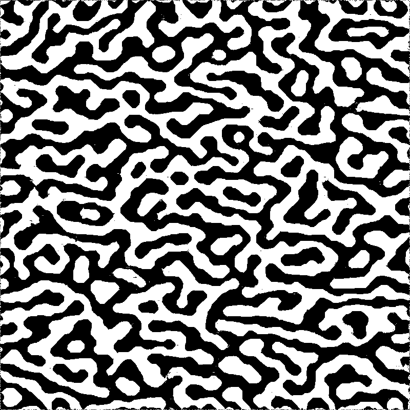
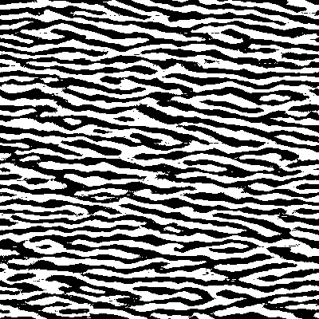

# maze-gen
Simple labyrinth generator

## Compilation

	clang -O3 maze.c -o maze
	clang -O3 bigmaze.c -o bigmaze
	clang -O3 periodic.c -o periodic

## Use

    maze 400 400 11 30 26 > out.pgm
    bigmaze 800 400 11 30 26 6 4 > out.pgm
Waves:
    periodic 400 400 11 30 26 3 2 > out.pgm
Sharkskin:
    periodic 400 400 11 30 26 201 209 > out.pgm
Cloth:
    periodic 400 400 11 30 26 80 61 > out.pgm

Parameters are:
1. image size
1. number of iterations
1. random seed
1. first LFSR tap
1. second tap
1. amount of scale variation (bigmaze only)
1. minimum scale (bigmaze only)

## Example output

From bigmaze.c:

From periodic.c:

